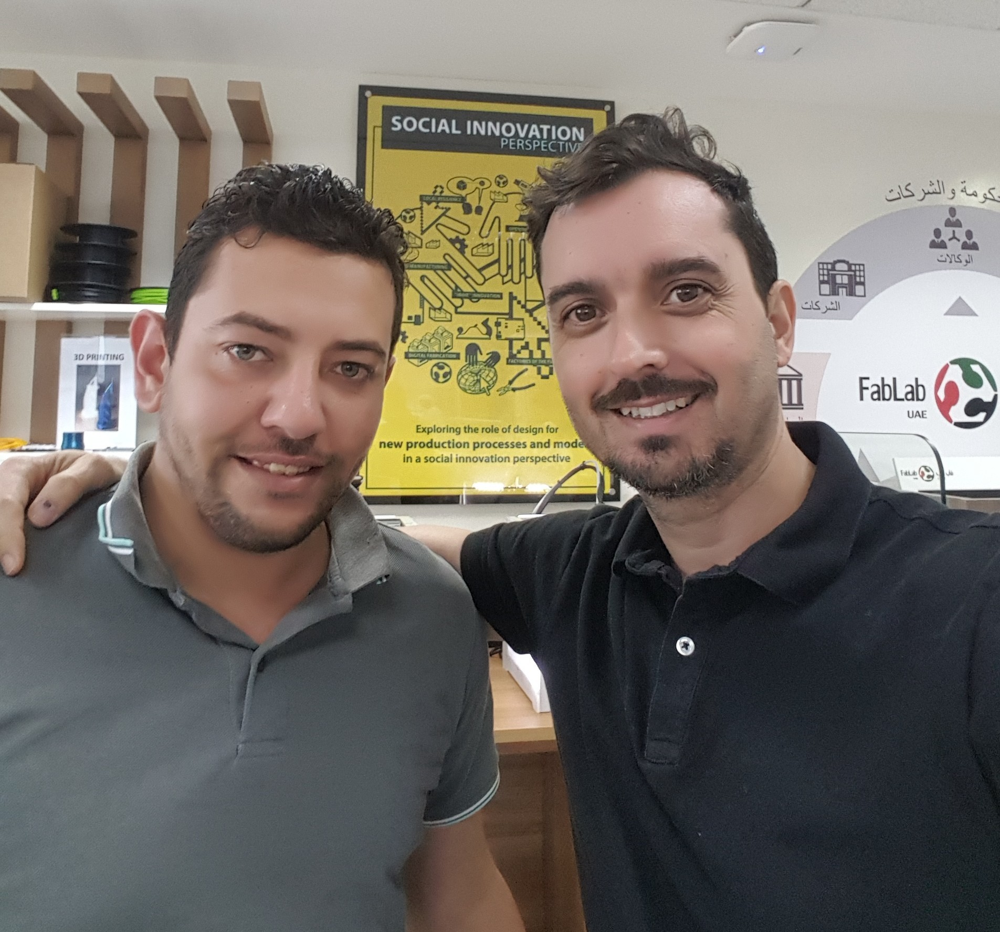
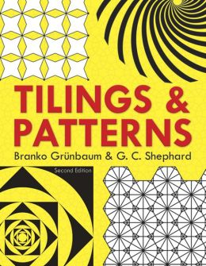

# Generative Design of Islamic Geometric Patterns

* [About the tutors](#about-the-tutors)
* [Description](#description)
* [Books](#books)
* [Software required](#software-required)
  * [Generic computational software](#generic-computational-software)
  * [Dedicated Islamic Patterns Design software](#dedicated-islamic-patterns-design-software)
    * [Taprats](#taprats)
    * [Arabeske](#arabeske)

Learn how to design, generate and compute beautiful islamic geometric patterns using open source computational design software.

* Workshop by: Francisco Sanchez (Spain) & Ahmed Galal (Egypt)
* Date: May 2017
* License: CC-SA-BY
* Type: Demo, 2 hours
* Participants: 10

## About the tutors

Francisco is an Spanish Civil Engineer founder of The (fabulous) Beach Lab. Ahmed Galal an Egyptian Telecommunications Engineer working in FabLab UAE in Dubai. In a collaborative exploration between both labs, we will join our passions for computational design, open source software and geometry in a fascinating journey into generative design of Islamic Geometric Patterns.

## Description

In Islamic culture, geometric design is everywhere: you can find it in mosques, madrasas, palaces, and private homes. And despite the complexity of these designs, they can be created with just a compass and a ruler. In this workshop you will discover how patterns of profound beauty and subtle complexity can be created from the simplest computational generative techniques by using freely available, multi platform, open source software.

## Books

  
**Islamic Geometric Patterns**  
*Eric Broug*  
The marvels of Islamic patterns—the most recognizable visual expression of Islamic art and architecture—are not just a beautiful accident. The ancient practitioners of this craft used traditional methods of measurement to create dazzling geometric compositions, often based on the repetition of a single pattern. The results are magnificent in their beauty and awe-inspiring in their execution.

  
**Tilings and Patterns**  
*Branko Grünbaum, G. C. Shephard*  
The definitive book on tiling and geometric patterns, this volume features 520 figures and over 100 tables. Accessible to anyone with a grasp of geometry, it offers illustrated examples of two-dimensional spaces covered with interlocking figures, plus related problems and references. Equally suitable for geometry courses and independent study.

## Software required

The following open source software is required for the workshop

### Generic computational software

* kturtle
* openSCAD
* antimony
* processing
* nodebox 3

### Dedicated Islamic Patterns Design software

#### Taprats

Taprats is a computer based design of Islamic geometric patterns created by Professor Kaplan. It is very easy to use. There is no need to write code. See this video explaining his computational approach:
https://www.youtube.com/watch?v=FBn6VgoF3fE&t=4060s

Taprats is an Open Source Software written in Java  
http://www.cgl.uwaterloo.ca/csk/washington/taprats/  
https://sourceforge.net/projects/taprats/  
Download the applet and run in terminal
`java -jar taprats.jar`

#### Arabeske

http://www.wozzeck.net/arabeske/ara_devel.html  
Download the file and run in terminal
`java -jar ara-2.1.0.jar`
